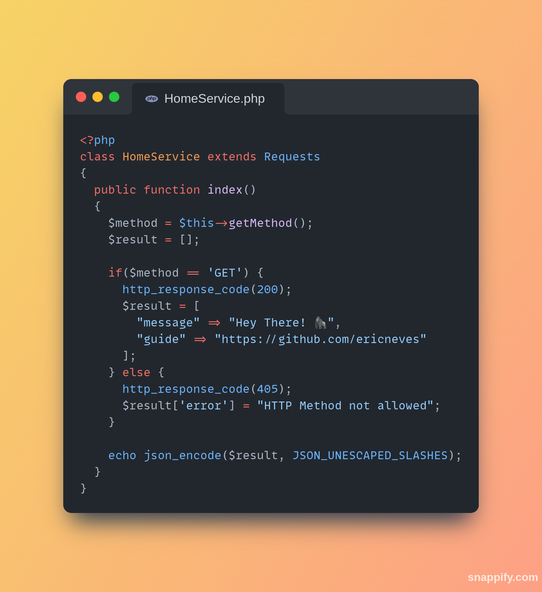

<h1 align="center">
  
  <br>
    Books API
  <br>
</h1>

<h4 align="center">
  API RESTFul desenvolvida com PHP, Mysql, autenticação por JWT, CRUD de dados, rotas e entre outros.
</h4>

<p align="center">
  
  
  
</p>

<p align="center">
  <a href="#features">Features</a> •
  <a href="#how-to-use">How to User ?</a>
</p>




URI: [In Progress]()

### Features

API desenvolvida com PHP, Mysql, Rotas, URL amigável, autenticação por JWT, OOP e muito mais.

* PHP
  - JWT
  - PDO (Mysql)
  - OOP 
  - Routes
  - SPL - Autoload
* MYSQL
  - DDL
  - DML

### How to use

Segue-se alguns passos para a execução da aplicação:

- Iniciar o servidor <b>Apache</b> e o <b>Mysql</b>.

- Configure o arquivo config.php com suas credenciais de banco de dados e edite o BASE_URL conforme a necessidade.

- Copie a pasta do projeto para dentro do servidor <b>Apache</b>.

- Ativar o ModRewrite: <b>comando via terminal</b>: ```a2enmod rewrite``` ou habilitar nas configurações do <b>Apache</b>.

- Executar os comandos <b>DDL</b> e <b>DML</b> do arquivo <b>database.sql</b>, o arquivo se encontra na raiz do projeto.

### How to consume API

Nos exemplos de consumo da API, será utilizado a funcionalidade Fetch API do Javascript.

```js
// 


```


### License 📃


---

### Author 🧑‍💻
><a href="https://www.instagram.com/ericneves_dev/"></a> <a href="https://linkedin.com/in/ericnevesrr"> </a>