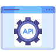

<h1 align="center">
  
   
    Books API
   
</h1>

<h4 align="center">
  API RESTFul desenvolvida com PHP, Mysql, autenticação por JWT, CRUD de dados, rotas 
</h4>

  
  
  

  <a href="#features">Features</a> •
  <a href="#how-to-use">How to User ?</a>

URI: [In Progress]()

### Features

In Progresss

* 
  - 
  - 
  - 

### How to use

In Progress

### License 📃

---

### Author 🧑‍💻
> 