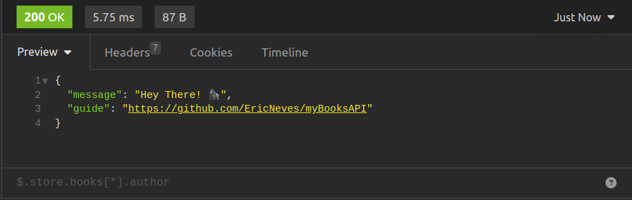

<h1 align="center">
  
  <br>
    Books API
  <br>
</h1>

<h4 align="center">
  API RESTFul desenvolvida com <b>PHP</b>, <b>Mysql</b>, autenticação por <b>JWT</b>, <b>CRUD</b> de dados, rotas e entre outros.
</h4>

<p align="center">
  
  
  
</p>

<p align="center">
  <a href="#features">Features</a> •
  <a href="#how-to-use">How to User ?</a>
</p>

<div align="center">




</div>

URI: [In Progress]()

### Features

API desenvolvida com <b>PHP</b>, <b>Mysql</b>, <b>Rotas</b>, <b>URL amigável</b>, autenticação por <b>JWT</b>, <b>OOP</b> e muito mais.
O projeto consiste da criação de usuários, podendo cada usuário, cadastrar, editar ou deletar seus livros.

* PHP
  - <b>JWT</b>
  - <b>PDO (Mysql)</b>
  - <b>OOP </b>
  - <b>Routes</b>
  - <b>SPL - Autoload</b>
* MYSQL
  - <b>DDL</b>
  - <b>DML</b>

### How to use

Segue-se alguns passos para a execução da aplicação:

- Iniciar o servidor <b>Apache</b> e o <b>Mysql</b>.

- Configure o arquivo config.php com suas credenciais de banco de dados e edite o BASE_URL conforme a necessidade.

- Copie a pasta do projeto para dentro do servidor <b>Apache</b>.

- Ativar o ModRewrite: <b>comando via terminal</b>: ```a2enmod rewrite``` ou habilitar nas configurações do <b>Apache</b>.

- Executar os comandos <b>DDL</b> e <b>DML</b> do arquivo <b>database.sql</b>, o arquivo se encontra na raiz do projeto.

### How to consume API

Nos exemplos de consumo da <b>API</b>, será utilizado a funcionalidade <b>Fetch API</b> do <b>Javascript</b>.

```sh
$ API home - @Route[GET] "/"
```

```js
// @Route[GET] "/" => API home 

fetch('http://127.0.0.1/myBooksAPI/')
  .then(res => res.json())
  .then(console.log)

/* {
  "message": "Hey There! 🦍",
  "guide": "https://github.com/EricNeves/myBooksAPI"
} */

```

```sh
$ Create a new user - @Route[POST] "/users/create"
```

```js
// @Route[POST] "/users/create" => Create a new user

const config = {
  method: 'POST',
  body: JSON.stringify({ name, email, password })
}

fetch('http://127.0.0.1/myBooksAPI/users/create', config)
  .then(res => res.json())
  .then(console.log)

/* {
  login: "http://127.0.0.1/github/myBooksAPI/users/login",
  message: "Created"
} */

```

```sh
$ Login user - @Route[POST] "/users/login"
```

```js
// @Route[POST] "/users/login" => Login user

const config = {
  method: 'POST',
  body: JSON.stringify({ email, password })
}

fetch('http://127.0.0.1/myBooksAPI/users/login')
  .then(res => res.json())
  .then(console.log)

/* {
  message: "successfully",
  token: your-jwt-token
} */

```

```sh
$ List user info - @Route[GET] "/users"
```

```js
// @Route[GET] "/users" => List user info

const config = {
  method: 'GET',
  headers: {
    Authorization: 'Bearer ${your-jwt-token}'
  }
}

fetch('http://127.0.0.1/myBooksAPI/users', config)
  .then(res => res.json())
  .then(console.log)

/* {
  data: {
    "id": your-id,
    "name": your-name,
    "email: your-email,
  }
} */

```

```sh
$ Update user - @Route[PUT] "/users/update"
```

```js
// @Route[PUT] "/users/update" => Update user

const config = {
  method: 'PUT',
  body: JSON.stringify({ name, password })
  headers: {
    Authorization: 'Bearer ${your-jwt-token}'
  }
}

fetch('http://127.0.0.1/myBooksAPI/users/update', config)
  .then(res => res.json())
  .then(console.log)

/* {message: 'User updated'} */

```

```sh
$ List user books - @Route[GET] "/books"
```

```js
// @Route[GET] "/books" => List books

const config = {
  method: 'GET',
  headers: {
    Authorization: 'Bearer ${your-jwt-token}'
  }
}

fetch('http://127.0.0.1/myBooksAPI/books')
  .then(res => res.json())
  .then(console.log)

/* {
  "quantity": 0,
	"books": []
} */

```

```sh
$ Create a book - @Route[POST] "/books/create"
```

```js
// @Route[POST] "/books/create" => Create a book

const config = {
  method: 'POST',
  body: JSON.stringofy({ title, year }),
  headers: {
    Authorization: 'Bearer ${your-jwt-token}'
  }
}

fetch('http://127.0.0.1/myBooksAPI/books/create')
  .then(res => res.json())
  .then(console.log)

/* { "message": "Book created" } */

```

```sh
$ List book by ID - @Route[GET] "/books/list/{id}"
```

```js
// @Route[GET] "/books/list/{book_id}" => List book by ID

const config = {
  method: 'GET',
  headers: {
    Authorization: 'Bearer ${your-jwt-token}'
  }
}

fetch('http://127.0.0.1/myBooksAPI/books/list/{book_id}')
  .then(res => res.json())
  .then(console.log)

/* {
  book: {
    "id": book_id,
    "title": book_title,
    "year_created": book_year,
    "user_id": user_id,
  }
} */

```

```sh
$ Update book - @Route[PUT] "/books/update/{book_id}"
```

```js
// @Route[PUT] "/books/update/{book_id}" => Update book 

const config = {
  method: 'PUT',
  body: JSON.stringify({ title, year }),
  headers: {
    Authorization: 'Bearer ${your-jwt-token}'
  }
}

fetch('http://127.0.0.1/myBooksAPI/update/{book_id}')
  .then(res => res.json())
  .then(console.log)

/* {message: 'Book updated'} */

```

```sh
$ Remove book - @Route[DELETE] "/books/remove/{book_id}"
```

```js
//  @Route[DELETE] "/books/remove/{book_id}" => Remove book

const config = {
  method: 'DELETE',
  headers: {
    Authorization: 'Bearer ${your-jwt-token}'
  }
}

fetch('http://127.0.0.1/myBooksAPI/books/remove/{book_id}')
  .then(res => res.json())
  .then(console.log)

/* {message: 'Book deleted'} */

```


### License 📃


---

### Author 🧑‍💻
><a href="https://www.instagram.com/ericneves_dev/"></a> <a href="https://linkedin.com/in/ericnevesrr"> </a>